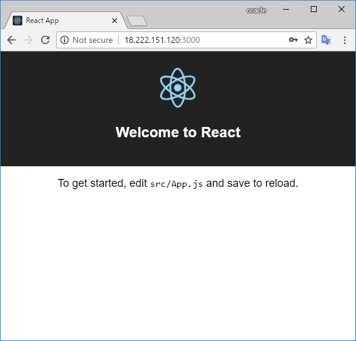

# aws-amplify

https://github.com/aws/aws-amplify

# install react

https://reactjs.org/tutorial/tutorial.html

```console
$ curl --silent --location https://rpm.nodesource.com/setup_8.x | sudo bash -
$ sudo yum -y install nodejs
$ node -v
v8.11.3
```

```console
$ sudo npm install -g create-react-app
/usr/bin/create-react-app -> /usr/lib/node_modules/create-react-app/index.js
+ create-react-app@1.5.2
added 67 packages in 4.757s
```

```console
$ create-react-app my-app

Creating a new React app in /home/ec2-user/my-app.

Installing packages. This might take a couple of minutes.
Installing react, react-dom, and react-scripts...


> uglifyjs-webpack-plugin@0.4.6 postinstall /home/ec2-user/my-app/node_modules/uglifyjs-webpack-plugin
> node lib/post_install.js

+ react@16.4.1
+ react-dom@16.4.1
+ react-scripts@1.1.4
added 1319 packages in 57.819s

Success! Created my-app at /home/ec2-user/my-app
Inside that directory, you can run several commands:

  npm start
    Starts the development server.

  npm run build
    Bundles the app into static files for production.

  npm test
    Starts the test runner.

  npm run eject
    Removes this tool and copies build dependencies, configuration files
    and scripts into the app directory. If you do this, you can’t go back!

We suggest that you begin by typing:

  cd my-app
  npm start

Happy hacking!
```

```console
$ cd my-app
$ npm start
```

```console
Compiled successfully!

You can now view my-app in the browser.

  Local:            http://localhost:3000/
  On Your Network:  http://172.31.37.47:3000/

Note that the development build is not optimized.
To create a production build, use npm run build.
```


```console
$ npm install --save aws-amplify
npm WARN ajv-keywords@3.2.0 requires a peer of ajv@^6.0.0 but none is installed. You must install peer dependencies yourself.
npm WARN optional SKIPPING OPTIONAL DEPENDENCY: fsevents@1.2.4 (node_modules/fsevents):
npm WARN notsup SKIPPING OPTIONAL DEPENDENCY: Unsupported platform for fsevents@1.2.4: wanted {"os":"darwin","arch":"any"} (current: {"os":"linux","arch":"x64"})

+ aws-amplify@1.0.0
added 28 packages in 14.169s
```
