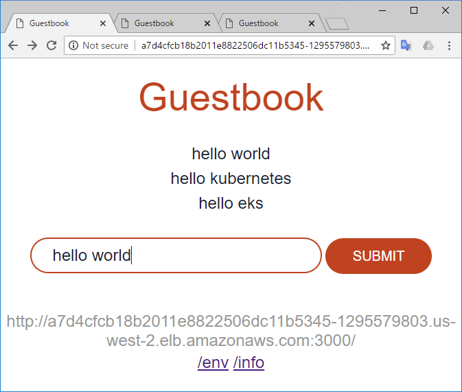
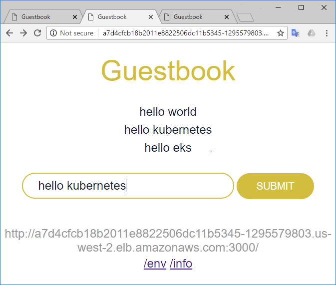
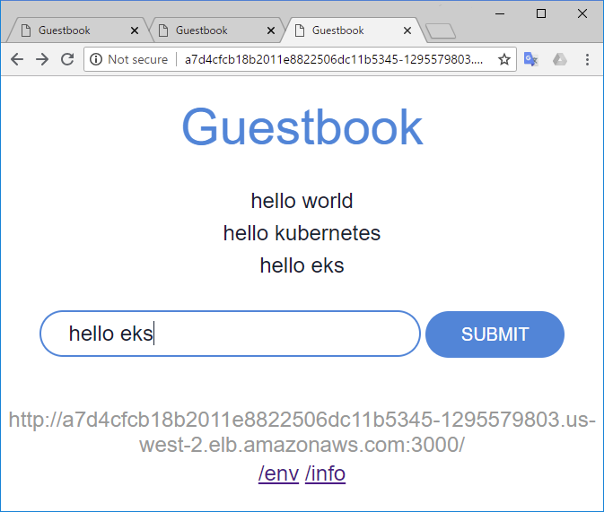

https://docs.aws.amazon.com/eks/latest/userguide/getting-started.html


preparation
----------
- jq 
- aws-cli (1.15.32+)

install jq
```console
$ sudo yum install -y jq
```
install pip
```console
$ sudo yum install -y python-pip 
```
install latest awscli
```console
$ pip install --user -U awscli
```
configure path
```console
$ echo 'export PATH=$HOME/.local/bin:$PATH' >> ~/.bashrc
$ bash -l
```
show version of awscli
```console
$ aws --version
aws-cli/1.15.61 Python/2.7.14 Linux/4.14.33-59.37.amzn2.x86_64 botocore/1.10.60
```

aws configure (create user permitted to do operation needed privileges of admin)
```console
$ aws configure --profile default set aws_access_key_id <AWS_ACCESS_KEY_ID>
$ aws configure --profile default set aws_secret_access_key <AWS_SECRET_ACCESS_KEY>
$ aws configure --profile default set region us-west-2
```

```console
$ aws configure list --profile default
      Name                    Value             Type    Location
      ----                    -----             ----    --------
   profile                  default           manual    --profile
access_key     ****************AAAA shared-credentials-file
secret_key     ****************BBBB shared-credentials-file
    region                us-west-2      config-file    ~/.aws/config
```

if using cross account add following
https://docs.aws.amazon.com/IAM/latest/UserGuide/tutorial_cross-account-with-roles.html
```console
$ aws configure --profile default set role_arn <arn:aws:iam:000000000000:role/ROLE_NAME>
$ aws configure --profile default set source_profile <default>
$ aws configure --profile default set role_session_name <SESSION_NAME>
```
```console
$ aws sts get-caller-identity # --query 'Account'
{
    "Account": "000000000000",
    "UserId": "AWOBJKF2PW5EU64TL3LQA:MYNAME",
    "Arn": "arn:aws:sts::000000000000:assumed-role/ROLE_NAME/SESSION_NAME"
}
```


create role for eks
```console
$ myenv=ekstmp
$ trust_relationship=$(echo '{
  "Version": "2012-10-17",
  "Statement": {
    "Effect": "Allow",
    "Principal": {"Service": "eks.amazonaws.com"},
    "Action": "sts:AssumeRole"
  }
}
' | jq -c -M .)
$ aws iam create-role --role-name "${myenv}-role" --assume-role-policy-document "${trust_relationship}"
{
    "Role": {
        "AssumeRolePolicyDocument": {
            "Version": "2012-10-17",
            "Statement": {
                "Action": "sts:AssumeRole",
                "Effect": "Allow",
                "Principal": {
                    "Service": "eks.amazonaws.com"
                }
            }
        },
        "RoleId": "AROAIGE2KTOJWTX7R43PI",
        "CreateDate": "2018-06-15T10:52:48.282Z",
        "RoleName": "eks-test-role",
        "Path": "/",
        "Arn": "arn:aws:iam::000000000000:role/ekstmp-role"
    }
}
$ aws iam attach-role-policy !:3 !:4 --policy-arn arn:aws:iam::aws:policy/AmazonEKSClusterPolicy
$ ^Cluster^Service
```

`AmazonEKSClusterPolicy`
```json
{
    "Version": "2012-10-17",
    "Statement": [
        {
            "Effect": "Allow",
            "Action": [
                "autoscaling:DescribeAutoScalingGroups",
                "autoscaling:UpdateAutoScalingGroup",
                "ec2:AttachVolume",
                "ec2:AuthorizeSecurityGroupIngress",
                "ec2:CreateRoute",
                "ec2:CreateSecurityGroup",
                "ec2:CreateTags",
                "ec2:CreateVolume",
                "ec2:DeleteRoute",
                "ec2:DeleteSecurityGroup",
                "ec2:DeleteVolume",
                "ec2:DescribeInstances",
                "ec2:DescribeRouteTables",
                "ec2:DescribeSecurityGroups",
                "ec2:DescribeSubnets",
                "ec2:DescribeVolumes",
                "ec2:DescribeVolumesModifications",
                "ec2:DescribeVpcs",
                "ec2:DetachVolume",
                "ec2:ModifyInstanceAttribute",
                "ec2:ModifyVolume",
                "ec2:RevokeSecurityGroupIngress",
                "elasticloadbalancing:AddTags",
                "elasticloadbalancing:ApplySecurityGroupsToLoadBalancer",
                "elasticloadbalancing:AttachLoadBalancerToSubnets",
                "elasticloadbalancing:ConfigureHealthCheck",
                "elasticloadbalancing:CreateListener",
                "elasticloadbalancing:CreateLoadBalancer",
                "elasticloadbalancing:CreateLoadBalancerListeners",
                "elasticloadbalancing:CreateLoadBalancerPolicy",
                "elasticloadbalancing:CreateTargetGroup",
                "elasticloadbalancing:DeleteListener",
                "elasticloadbalancing:DeleteLoadBalancer",
                "elasticloadbalancing:DeleteLoadBalancerListeners",
                "elasticloadbalancing:DeleteTargetGroup",
                "elasticloadbalancing:DeregisterInstancesFromLoadBalancer",
                "elasticloadbalancing:DeregisterTargets",
                "elasticloadbalancing:DescribeListeners",
                "elasticloadbalancing:DescribeLoadBalancerAttributes",
                "elasticloadbalancing:DescribeLoadBalancerPolicies",
                "elasticloadbalancing:DescribeLoadBalancers",
                "elasticloadbalancing:DescribeTargetGroupAttributes",
                "elasticloadbalancing:DescribeTargetGroups",
                "elasticloadbalancing:DescribeTargetHealth",
                "elasticloadbalancing:DetachLoadBalancerFromSubnets",
                "elasticloadbalancing:ModifyListener",
                "elasticloadbalancing:ModifyLoadBalancerAttributes",
                "elasticloadbalancing:ModifyTargetGroup",
                "elasticloadbalancing:ModifyTargetGroupAttributes",
                "elasticloadbalancing:RegisterInstancesWithLoadBalancer",
                "elasticloadbalancing:RegisterTargets",
                "elasticloadbalancing:SetLoadBalancerPoliciesForBackendServer",
                "elasticloadbalancing:SetLoadBalancerPoliciesOfListener",
                "kms:DescribeKey"
            ],
            "Resource": "*"
        }
    ]
}
```

AmazonEKSServicePolicy
```json
{
    "Version": "2012-10-17",
    "Statement": [
        {
            "Effect": "Allow",
            "Action": [
                "ec2:CreateNetworkInterface",
                "ec2:CreateNetworkInterfacePermission",
                "ec2:DeleteNetworkInterface",
                "ec2:DescribeInstances",
                "ec2:DescribeNetworkInterfaces",
                "ec2:DescribeSecurityGroups",
                "ec2:DescribeSubnets",
                "ec2:DescribeVpcs",
                "ec2:ModifyNetworkInterfaceAttribute",
                "iam:ListAttachedRolePolicies"
            ],
            "Resource": "*"
        },
        {
            "Effect": "Allow",
            "Action": [
                "ec2:CreateTags",
                "ec2:DeleteTags"
            ],
            "Resource": [
                "arn:aws:ec2:*:*:vpc/*",
                "arn:aws:ec2:*:*:subnet/*"
            ]
        }
    ]
}
```

create vpc from cf for eks
```console
$ aws cloudformation create-stack \
--stack-name ${myenv} \
--template-url https://amazon-eks.s3-us-west-2.amazonaws.com/1.10.3/2018-06-05/amazon-eks-vpc-sample.yaml
{
    "StackId": "arn:aws:cloudformation:us-west-2:000000000000:stack/ekstmp/b90e07a0-8b02-11e8-83cb-503ac9316861"
}
```

show list of resources
```console
$ aws cloudformation describe-stack-resources \
--stack-name ${myenv} | \
jq -c -S '.[][]| [.ResourceType,.PhysicalResourceId]'
["AWS::EC2::SecurityGroup","sg-8a5c38fa"]
["AWS::EC2::InternetGateway","igw-d73d19b1"]
["AWS::EC2::Route","ekstm-Route-SM139PSVYR5Q"]
["AWS::EC2::RouteTable","rtb-b4be76cf"]
["AWS::EC2::Subnet","subnet-e268289b"]
["AWS::EC2::SubnetRouteTableAssociation","rtbassoc-e8b71095"]
["AWS::EC2::Subnet","subnet-41c4a60a"]
["AWS::EC2::SubnetRouteTableAssociation","rtbassoc-f3b0178e"]
["AWS::EC2::Subnet","subnet-2bc29071"]
["AWS::EC2::SubnetRouteTableAssociation","rtbassoc-d9a700a4"]
["AWS::EC2::VPC","vpc-ff24ce87"]
["AWS::EC2::VPCGatewayAttachment","ekstm-VPCGa-GD97KJ7Y3Q8T"]
```

install kubectl for eks
```console
$ curl -SsL -O https://amazon-eks.s3-us-west-2.amazonaws.com/1.10.3/2018-06-05/bin/linux/amd64/kubectl
$ chmod +x !$:t
$ mv !$ $HOME/.local/bin/
$ kubectl version --short --client
Client Version: v1.10.3
```

install heptio-authenticator-aws for eks
```console
$ curl -SsL -O https://amazon-eks.s3-us-west-2.amazonaws.com/1.10.3/2018-06-05/bin/linux/amd64/heptio-authenticator-aws
$ chmod +x !$:t
$ mv !$ $HOME/.local/bin/
$ heptio-authenticator-aws help
A tool to authenticate to Kubernetes using AWS IAM credentials

Usage:
  heptio-authenticator-aws [command]

Available Commands:
  help        Help about any command
  init        Pre-generate certificate, private key, and kubeconfig files for the server.
  server      Run a webhook validation server suitable that validates tokens using AWS IAM
  token       Authenticate using AWS IAM and get token for Kubernetes
  verify      Verify a token for debugging purpose

Flags:
  -i, --cluster-id ID     Specify the cluster ID, a unique-per-cluster identifier for your heptio-authenticator-aws installation.
  -c, --config filename   Load configuration from filename
  -h, --help              help for heptio-authenticator-aws

Use "heptio-authenticator-aws [command] --help" for more information about a command.
```

create eks cluster 
```console
$ role=$(aws iam get-role --role-name "${myenv}-role" --query Role.Arn | jq -r .)
$ echo $role
arn:aws:iam::000000000000:role/ekstmp-role
```

```console
$ subnetids=$(aws cloudformation describe-stack-resources --stack-name ${myenv} --query 'StackResources[?ResourceType==`AWS::EC2::Subnet`]' | jq -r 'map(.PhysicalResourceId)|@csv' |tr -d '"')
$ echo $subnetids
subnet-e268289b,subnet-41c4a60a,subnet-2bc29071
```

```console
$ sg=$(aws cloudformation describe-stack-resources --stack-name ${myenv} --query 'StackResources[?ResourceType==`AWS::EC2::SecurityGroup`]' | jq -r '.[].PhysicalResourceId')
$ echo $sg
sg-8a5c38fa
```
```console
$ vpcid=$(aws cloudformation describe-stack-resources --stack-name ${myenv} --query 'StackResources[?ResourceType==`AWS::EC2::VPC`]' | jq -r '.[].PhysicalResourceId')
$ echo $vpcid
vpc-ff24ce87
```

```console
$ aws eks create-cluster --name ${myenv} --role-arn "$role" --resources-vpc-config subnetIds=${subnetids},securityGroupIds=$sg
{
    "cluster": {
        "status": "CREATING",
        "name": "ekstmp",
        "certificateAuthority": {},
        "roleArn": "arn:aws:iam::000000000000:role/ekstmp-role",
        "resourcesVpcConfig": {
            "subnetIds": [
                "subnet-e268289b",
                "subnet-41c4a60a",
                "subnet-2bc29071"
            ],
            "vpcId": "vpc-ff24ce87",
            "securityGroupIds": [
                "sg-8a5c38fa"
            ]
        },
        "version": "1.10",
        "arn": "arn:aws:eks:us-west-2:000000000000:cluster/ekstmp",
        "createdAt": 1531971069.818
    }
}
```

```console
$ aws eks describe-cluster --name ${myenv} --query cluster.status
"CREATING"
```
wait a bit
```console
$ aws eks describe-cluster --name ${myenv} --query cluster.status
"ACTIVE"
```
```console
$ endp=$(aws eks describe-cluster --name ${myenv} --query cluster.endpoint| jq -r .)
$ echo $endp
"https://7BA864A09EED630B9D611FCF9CAB689B.yl4.us-west-2.eks.amazonaws.com"
```

```console
$ cert=$(aws eks describe-cluster --name ${myenv} --query cluster.certificateAuthority.data | jq -r .)
$ echo $cert
LS0tLS1CRUdJTiBDRVJUSUZJQ0FURS0tLS0tCk1JSUN5RENDQWJDZ0F3SUJBZ0lCQURBTkJna3Foa2l
--snip--
wVFNxUER6aWRvT0RXMGc0MGVTR0dsMGxNaGpmdC9TOD0KLS0tLS1FTkQgQ0VSVElGSUNBVEUtLS0tLQo=
```


```
$ rolearn=$(aws iam get-role --role-name ${myenv}-role --query 'Role.Arn' | jq -r .)
$ echo $rolearn
arn:aws:iam::000000000000:role/ekstmp-role
```

```console
$ mkdir -p ~/.kube
```
```console
$ touch !$/config-${myenv}
```


```yaml
apiVersion: v1
clusters:
- cluster:
    server: <endpoint-url>
    certificate-authority-data: <base64-encoded-ca-cert>
  name: kubernetes
contexts:
- context:
    cluster: kubernetes
    user: aws
  name: aws
current-context: aws
kind: Config
preferences: {}
users:
- name: aws
  user:
    exec:
      apiVersion: client.authentication.k8s.io/v1alpha1
      command: heptio-authenticator-aws
      args:
        - "token"
        - "-i"
        - "<cluster-name>"
        # - "-r"
        # - "<role-arn>"
      # env:
        # - name: AWS_PROFILE
        #   value: "<aws-profile>"
```

```console
$ cat <<EOF > !$
apiVersion: v1
clusters:
- cluster:
    server: $endp
    certificate-authority-data: $cert
  name: kubernetes
contexts:
- context:
    cluster: kubernetes
    user: aws
  name: aws
current-context: aws
kind: Config
preferences: {}
users:
- name: aws
  user:
    exec:
      apiVersion: client.authentication.k8s.io/v1alpha1
      command: heptio-authenticator-aws
      args:
        - "token"
        - "-i"
        - "${myenv}"
        # - "-r"
        # - "<role-arn>"
      # env:
        # - name: AWS_PROFILE
        #   value: "<aws-profile>"
EOF
```

```console
$ export KUBECONFIG=$KUBECONFIG:~/.kube/config-ekstmp
$ echo $KUBECONFIG
:/home/ec2-user/.kube/config-ekstmp
```


```console
$ kubectl get svc
NAME         TYPE        CLUSTER-IP   EXTERNAL-IP   PORT(S)   AGE
kubernetes   ClusterIP   10.100.0.1   <none>        443/TCP   1h
```

get ami-id(eks optimize)
```console
$ aws ec2 describe-images --image-id ami-73a6e20b
{
    "Images": [
        {
            "VirtualizationType": "hvm",
            "Description": "Kubernetes Worker AMI with AmazonLinux2 image",
            "Hypervisor": "xen",
            "EnaSupport": true,
            "SriovNetSupport": "simple",
            "ImageId": "ami-73a6e20b",
            "State": "available",
            "BlockDeviceMappings": [
                {
                    "DeviceName": "/dev/xvda",
                    "Ebs": {
                        "Encrypted": false,
                        "DeleteOnTermination": true,
                        "VolumeType": "gp2",
                        "VolumeSize": 20,
                        "SnapshotId": "snap-01d7262bcf617a3b2"
                    }
                }
            ],
            "Architecture": "x86_64",
            "ImageLocation": "602401143452/eks-worker-v20",
            "RootDeviceType": "ebs",
            "OwnerId": "602401143452",
            "RootDeviceName": "/dev/xvda",
            "CreationDate": "2018-06-04T06:02:17.000Z",
            "Public": true,
            "ImageType": "machine",
            "Name": "eks-worker-v20"
        }
    ]
}
```
```console
$ ami=$(aws ec2 describe-images --filters Name=owner-id,Values=602401143452 Name=is-public,Values=true Name=virtualization-type,Values=hvm Name=root-device-type,Values=ebs Name=name,Values=*eks-worker* | jq  '.[] | sort_by(.CreationDate) | reverse | .[] | select( (.Description | (contains("Candidate")|not)) and   (.Description | (contains("Minimal")|not))  )' | jq -s -r '.[0].ImageId')
$ echo $ami
ami-73a6e20b
```
create key pair
```console
$ aws ec2 create-key-pair --key-name ${myenv}-key | jq .KeyMaterial -r > ${myenv}-key_pair
$ chmod 600 !$
```

parameters

```console
$ params=$(cat <<EOF | jq -r -c '.'
[
  {
    "ParameterKey": "ClusterName",
    "ParameterValue": "${myenv}"
  },
  {
    "ParameterKey": "ClusterControlPlaneSecurityGroup",
    "ParameterValue": "${sg}"
  },
  {
    "ParameterKey": "NodeGroupName",
    "ParameterValue": "${myenv}-nodes"
  },
  {
    "ParameterKey": "NodeImageId",
    "ParameterValue": "${ami}"
  },
  {
    "ParameterKey": "KeyName",
    "ParameterValue": "${myenv}-key"
  },
  {
    "ParameterKey": "VpcId",
    "ParameterValue": "${vpcid}"
  },
  {
    "ParameterKey": "Subnets",
    "ParameterValue": "${subnetids}"
  }
]
EOF
)
```

```console
$ aws cloudformation create-stack \
--stack-name ${myenv}-worker-nodes \
--parameters ${params} \
--capabilities CAPABILITY_IAM \
--template-url https://amazon-eks.s3-us-west-2.amazonaws.com/1.10.3/2018-06-05/amazon-eks-nodegroup.yaml
{
    "StackId": "arn:aws:cloudformation:us-west-2:000000000000:stack/ekstmp-worker-nodes/e2a14760-8b13-11e8-9ca3-500c32c86cd1"
}
```

```console
$ aws cloudformation describe-stack-resources \
--stack-name ${myenv}-worker-nodes | \
jq -c -S '.[][]| [.ResourceType,.PhysicalResourceId]'
["AWS::EC2::SecurityGroupIngress","ClusterControlPlaneSecurityGroupIngress"]
["AWS::EC2::SecurityGroupEgress","ekstmp-worker-nodes-ControlPlaneEgressToNodeSecurityGroup-1P1PQJQJWJCGZ"]
["AWS::AutoScaling::AutoScalingGroup","ekstmp-worker-nodes-NodeGroup-1NPLSMJTSU5IL"]
["AWS::IAM::InstanceProfile","ekstmp-worker-nodes-NodeInstanceProfile-1T8R9RFNVSIS2"]
["AWS::IAM::Role","ekstmp-worker-nodes-NodeInstanceRole-1TV58NBJG4VS"]
["AWS::AutoScaling::LaunchConfiguration","ekstmp-worker-nodes-NodeLaunchConfig-2MJBB6DSV35R"]
["AWS::EC2::SecurityGroup","sg-923c5be2"]
["AWS::EC2::SecurityGroupIngress","NodeSecurityGroupFromControlPlaneIngress"]
["AWS::EC2::SecurityGroupIngress","NodeSecurityGroupIngress"]
```
```console
$ curl -SsLO https://amazon-eks.s3-us-west-2.amazonaws.com/1.10.3/2018-06-05/aws-auth-cm.yaml
```
```yaml
apiVersion: v1
kind: ConfigMap
metadata:
  name: aws-auth
  namespace: kube-system
data:
  mapRoles: |
    - rolearn: <ARN of instance role (not instance profile)>
      username: system:node:{{EC2PrivateDNSName}}
      groups:
        - system:bootstrappers
        - system:nodes
```        
```console
$ instancerole=$(aws cloudformation describe-stack-resources --stack-name ${myenv}-worker-nodes --query 'StackResources[?ResourceType==`AWS::IAM::Role`]' | jq -r '.[].PhysicalResourceId')
$ echo $instancerole
ekstmp-worker-nodes-NodeInstanceRole-1TV58NBJG4VS
```

```console
$ rolearn=$(aws iam get-role --role-name $instancerole | jq -r '.[].Arn')
echo $rolearn
arn:aws:iam::000000000000:role/ekstmp-worker-nodes-NodeInstanceRole-1TV58NBJG4VS
```


```console
$ sed -e 's,\(- rolearn: \).*,\1'$rolearn',' -i aws-auth-cm.yaml
```

```console
$ kubectl apply -f aws-auth-cm.yaml
configmap "aws-auth" created
```

wait for those become ready
```console
$ kubectl get nodes --watch
NAME                                            STATUS     ROLES     AGE       VERSION
ip-192-168-115-3.us-west-2.compute.internal     NotReady   <none>    16s       v1.10.3
ip-192-168-167-230.us-west-2.compute.internal   NotReady   <none>    16s       v1.10.3
ip-192-168-201-77.us-west-2.compute.internal    NotReady   <none>    15s       v1.10.3
ip-192-168-167-230.us-west-2.compute.internal   Ready     <none>    20s       v1.10.3
ip-192-168-115-3.us-west-2.compute.internal   Ready     <none>    20s       v1.10.3
ip-192-168-201-77.us-west-2.compute.internal   Ready     <none>    20s       v1.10.3
ip-192-168-167-230.us-west-2.compute.internal   Ready     <none>    30s       v1.10.3
ip-192-168-115-3.us-west-2.compute.internal   Ready     <none>    30s       v1.10.3
ip-192-168-201-77.us-west-2.compute.internal   Ready     <none>    30s       v1.10.3
```


log in to a one of workers
```console
$ asg=$(aws cloudformation describe-stack-resources --stack-name ${myenv}-worker-nodes --query 'StackResources[?ResourceType==`AWS::AutoScaling::AutoScalingGroup`]' | jq -r '.[].PhysicalResourceId')
$ echo $asg
ekstmp-worker-nodes-NodeGroup-1NPLSMJTSU5IL
```
```console
$ instanceid=$(aws autoscaling describe-auto-scaling-groups --auto-scaling-group-names ekstmp-worker-nodes-NodeGroup-1NPLSMJTSU5IL | jq -r '.[][].Instances[0].InstanceId')
```
```console
$ workerip0=$(aws ec2 describe-instances --instance-ids  $instanceid --query 'Reservations[*].Instances[*].PublicIpAddress' --output text)
$ ssh -i ${myenv}-key_pair -l ec2-user $workerip0
Last login: Thu Jul 19 06:12:03 2018 from ec2-000-000-000-000.us-east-2.compute.amazonaws.com

       __|  __|_  )
       _|  (     /   Amazon Linux 2 AMI
      ___|\___|___|

https://aws.amazon.com/amazon-linux-2/
```
```console
$ yum list installed "docker*"
Loaded plugins: priorities, update-motd
Installed Packages
docker.x86_64                                   17.06.2ce-1.102.amzn2                                    @amzn2-core
```
```console
$ docker ps -a
CONTAINER ID        IMAGE                                                              COMMAND                  CREATED             STATUS                      PORTS               NAMES
44ba5991e712        7e6390decb99                                                       "/bin/sh -c /app/i..."   35 minutes ago      Up 35 minutes                                   k8s_aws-node_aws-node-t8xwl_kube-system_a7d9de1c-8b19-11e8-86f2-02a1729be59a_1
34b091d84503        602401143452.dkr.ecr.us-west-2.amazonaws.com/eks/kube-proxy        "/bin/sh -c 'kube-..."   36 minutes ago      Up 36 minutes                                   k8s_kube-proxy_kube-proxy-6z78g_kube-system_a7d9f05d-8b19-11e8-86f2-02a1729be59a_0
34b53e80bbc4        602401143452.dkr.ecr.us-west-2.amazonaws.com/amazon-k8s-cni        "/bin/sh -c /app/i..."   36 minutes ago      Exited (1) 35 minutes ago                       k8s_aws-node_aws-node-t8xwl_kube-system_a7d9de1c-8b19-11e8-86f2-02a1729be59a_0
3d306b111d93        602401143452.dkr.ecr.us-west-2.amazonaws.com/eks/pause-amd64:3.1   "/pause"                 36 minutes ago      Up 36 minutes                                   k8s_POD_aws-node-t8xwl_kube-system_a7d9de1c-8b19-11e8-86f2-02a1729be59a_0
1b81e126d958        602401143452.dkr.ecr.us-west-2.amazonaws.com/eks/pause-amd64:3.1   "/pause"                 36 minutes ago      Up 36 minutes                                   k8s_POD_kube-proxy-6z78g_kube-system_a7d9f05d-8b19-11e8-86f2-02a1729be59a_0
```
```console
$ docker images
REPOSITORY                                                     TAG                 IMAGE ID            CREATED             SIZE
602401143452.dkr.ecr.us-west-2.amazonaws.com/eks/pause-amd64   3.1                 9e462c010bf3        6 weeks ago         742kB
602401143452.dkr.ecr.us-west-2.amazonaws.com/amazon-k8s-cni    1.0.0               7e6390decb99        6 weeks ago         347MB
602401143452.dkr.ecr.us-west-2.amazonaws.com/eks/kube-proxy    v1.10.3             c6fc6eef666a        7 weeks ago         96.9MB
```
```console
$ exit
```

launch a guest book app
```console
$ url=https://raw.githubusercontent.com/kubernetes/kubernetes/v1.10.3/examples/guestbook-go
```
```console
$ kubectl apply -f $url/redis-master-controller.json
replicationcontroller "redis-master" created
```
```console
$ kubectl apply -f $url/redis-master-service.json
service "redis-master" created
```
```console
$ kubectl apply -f $url/redis-slave-controller.json
replicationcontroller "redis-slave" created
```
```console
$ kubectl apply -f $url/redis-slave-service.json
service "redis-slave" created
```
```console
$ kubectl apply -f $url/guestbook-controller.json
replicationcontroller "guestbook" created
```
```console
$ kubectl apply -f $url/guestbook-service.json
service "guestbook" created
```

```console
$ kubectl get services -o wide
NAME           TYPE           CLUSTER-IP       EXTERNAL-IP                                                               PORT(S)          AGE       SELECTOR
guestbook      LoadBalancer   10.100.101.238   a7d4cfcb18b2011e8822506dc11b5345-1295579803.us-west-2.elb.amazonaws.com   3000:30491/TCP   2m        app=guestbook
kubernetes     ClusterIP      10.100.0.1       <none>                                                                    443/TCP          3h        <none>
redis-master   ClusterIP      10.100.221.180   <none>                                                                    6379/TCP         2m        app=redis,role=master
redis-slave    ClusterIP      10.100.75.37     <none>                                                                    6379/TCP         2m        app=redis,role=slave
```




