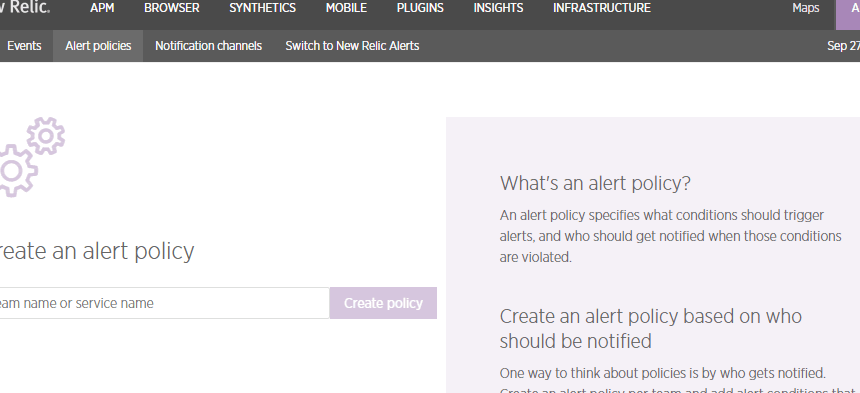
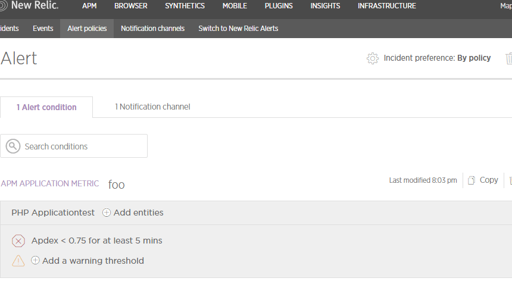

from terraform
---------------


```HCL
# Configure the New Relic provider
provider "newrelic" {
  api_key = "${var.newrelic_api_key}"
}

# Create an alert policy
resource "newrelic_alert_policy" "alert" {
  name = "Alert"
}

# Add a condition
resource "newrelic_alert_condition" "foo" {
  policy_id = "${newrelic_alert_policy.alert.id}"

  name        = "foo"
  type        = "apm_app_metric"
  condition_scope = "application"
  entities    = ["12345"]                             # You can look this up in New Relic
  metric      = "apdex"
  runbook_url = "https://docs.example.com/my-runbook"

  term {
    duration      = 5
    operator      = "below"
    priority      = "critical"
    threshold     = "0.75"
    time_function = "all"
  }
}

# Add a notification channel
resource "newrelic_alert_channel" "email" {
  name = "email"
  type = "email"

  configuration = {
    recipients              = "paul@example.com"
    include_json_attachment = "1"
  }
}

# Link the channel to the policy
resource "newrelic_alert_policy_channel" "alert_email" {
  policy_id  = "${newrelic_alert_policy.alert.id}"
  channel_id = "${newrelic_alert_channel.email.id}"
}
```

```
terraform init
terraform plan
terraform apply
```





trouble shoot
-----------------
```
Error applying plan:

1 error(s) occurred:

* newrelic_alert_condition.foo: 1 error(s) occurred:

* newrelic_alert_condition.foo: `condition_scope` must be `application` or `instance`.
```

```
1 error(s) occurred:

* newrelic_alert_condition.foo: expected term.0.duration to be one of [5 10 15 30 60 120], got 6
```
