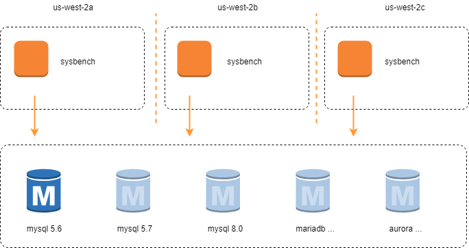

## engines

aws rds

| engine | major | minor |
|---------|-------|-------|
| mysql | 5.6 | 41 |
|  | 5.7 | 23 |
|  | 8.0 | 11 |
| mariadb | 10.1 | 34 |
|  | 10.2 | 15 |
|  | 10.3 | 8 |
| aurora | 5.6 | 10a |
|  | 5.7 | 12 |

## tests

- bulk insert 
- delete
- insert
- point select
- read only
- read write
- update index
- update non index
- write only
- select random points
- select random ranges
