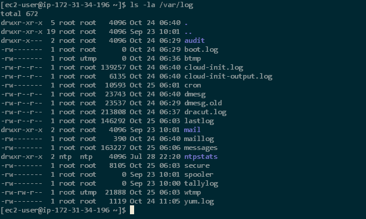

configuration (if use solarized color scheme)

```bash
dircolors -p > ~/.dircolors
sed -e 's/DIR 01;34\(.*\)/DIR 01;35\1/' -i ~/.dircolors
eval "$(dircolors ~/.dircolors)"
```

code above to `~/.bashrc` or `~/.bash_profile`


simplify

named file `.dir_colors`
```
dircolors -p > ~/.dir_colors
vim ~/.dir_colors 

#relogin
```

for all user

```
cp /etc/DIR_COLORS{,.org}
sed -e 's/DIR 01;34\(.*\)/DIR 01;35\1/' -i /etc/DIR_COLORS
```




this is better than above
https://github.com/seebi/dircolors-solarized/blob/master/dircolors.ansi-dark
```
DIR 34
```


## better way

https://github.com/seebi/dircolors-solarized

```console
$ git clone  https://github.com/seebi/dircolors-solarized
$ cp !$:t/dircolors.256dark ~/.dir_colors
$ echo "export TERM=xterm-256color" >> ~/.bashrc
$ bash -l
```

