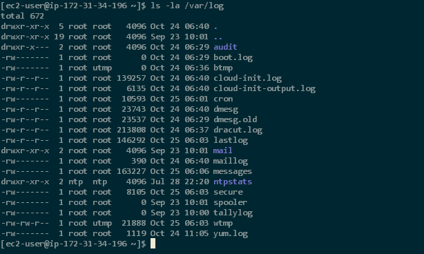

configuration (if use solarized color scheme)

```bash
dircolors -p > ~/.dircolors
sed -e 's/DIR 01;34\(.*\)/DIR 01;35\1/' -i ~/.dircolors
eval "$(dircolors ~/.dircolors)"
```

code above to `~/.bashrc` or `~/.bash_profile`


simplify

named file `.dir_colors`
```
dircolors -p > ~/.dir_colors
vim ~/.dir_colors 

#relogin
```



