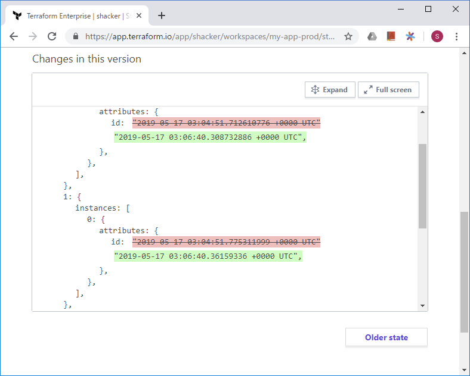
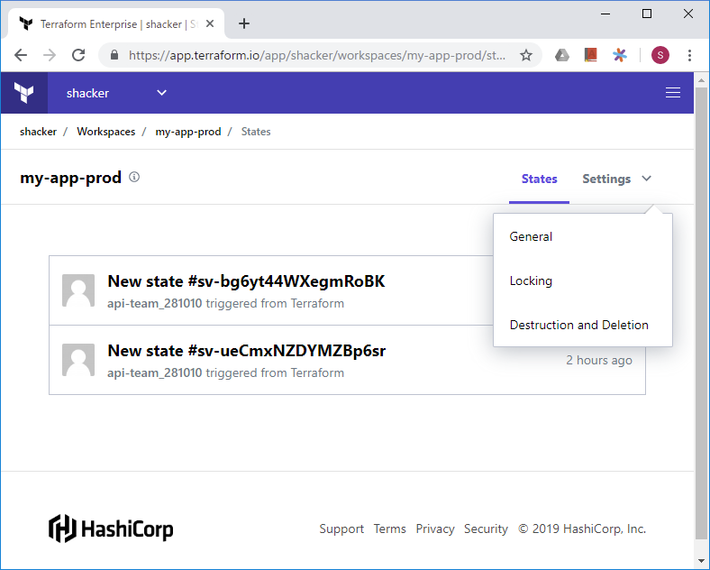

# Terraform Cloud
https://www.hashicorp.com/blog/introducing-terraform-cloud-remote-state-management

https://app.terraform.io/signup?utm_source=blog&utm_campaign=intro_tf_cloud_remote


sign up or sign in
--
https://app.terraform.io/signup/account


step
--

1. create organization
2. create `user access token`
3. configure remote backend
4. re-initialize


step1
--

create organization

step2
--

User -> settings -> Tokens

input description to textarea and click `Generate token` button, and copy it

step3
--

```HCL
terraform {
  backend "remote" {
    hostname     = "app.terraform.io"
    organization = "my-org"
    token        = "xxxxx.atlasv1.xxxxxx"
    # recommend setting token in CLI config file 
    
    workspaces {
      name = "my-app-name"
    }
  }
}
```

setp4
--

```console
$ terraform init
Initializing the backend...
Backend configuration changed!

Terraform has detected that the configuration specified for the backend
has changed. Terraform will now check for existing state in the backends.


Terraform detected that the backend type changed from "s3" to "remote".
Destination state "remote" doesn't support workspaces.
Do you want to copy only your current workspace?
  The existing "s3" backend supports workspaces and you currently are
  using more than one. The newly configured "remote" backend doesn't support
  workspaces. If you continue, Terraform will copy your current workspace "t012"
  to the default workspace in the target backend. Your existing workspaces in the
  source backend won't be modified. If you want to switch workspaces, back them
  up, or cancel altogether, answer "no" and Terraform will abort.

  Enter a value: yes

```



