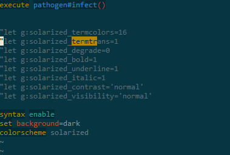
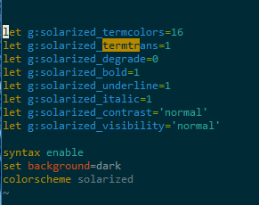

https://github.com/altercation/vim-colors-solarized


```bash
$ git clone https://github.com/altercation/vim-colors-solarized.git
$ cd vim-colors-solarized/colors
$ mv solarized.vim ~/.vim/colors/
```


```vim
let g:solarized_termcolors=16
let g:solarized_termtrans=1
let g:solarized_degrade=0
let g:solarized_bold=1
let g:solarized_underline=1
let g:solarized_italic=1
let g:solarized_contrast='normal'
let g:solarized_visibility='normal'

syntax enable
set background=dark
colorscheme solarized
```


`let g:solarized_termtrans=1`




or
```
export TERM=xterm-256color
```
