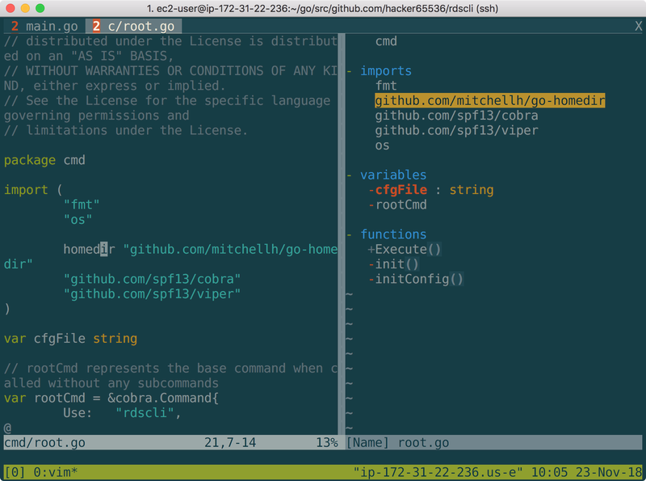

https://github.com/majutsushi/tagbar

```console
$ cd ~/.vim/bundle/
$ git clone https://github.com/majutsushi/tagbar.git
$ cd -
```

```vim
nmap <F8> :TagbarToggle<CR>
```

if using mac [system preferences] -> [Keyboard] -> check Use F1,F2,etc, keys as standard function keys


